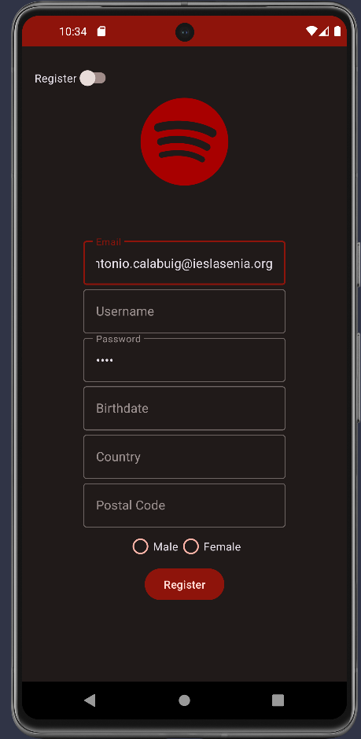
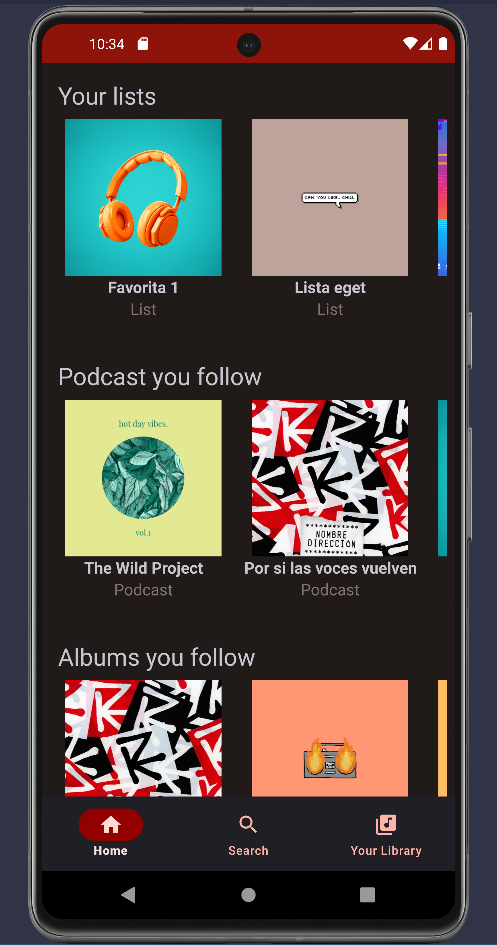
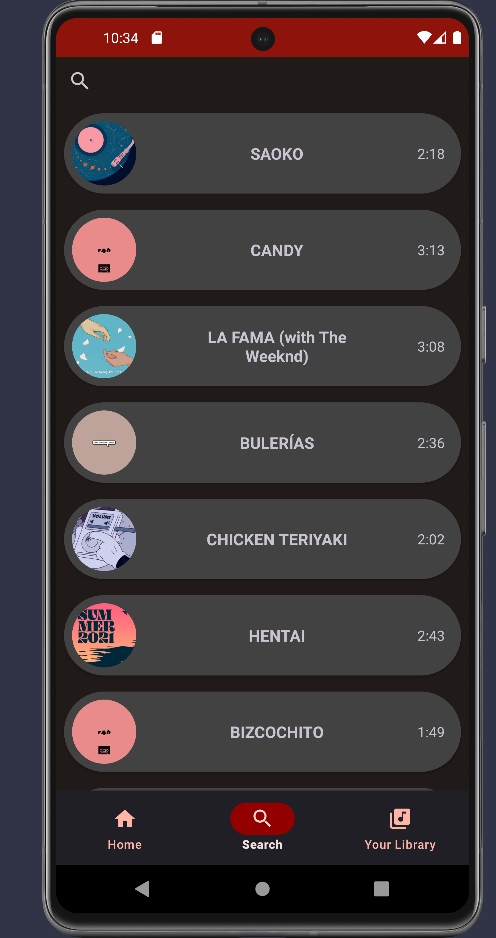
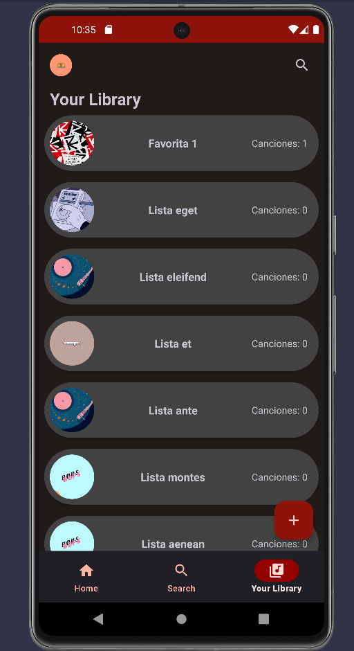
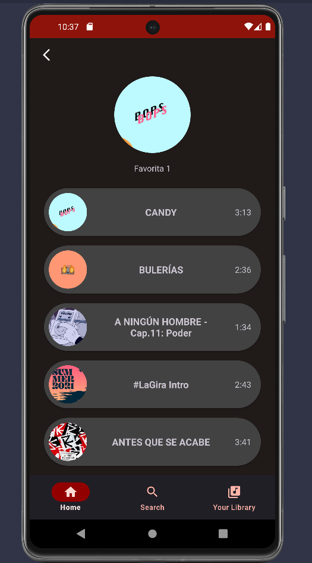

 

  
<h1 align="center">Spafy</h1>
  

    Spafy is a music application that allows you to listen to your favorite songs, create playlists, and much more.
     
    <a href="https://github.com/Zenin0/Spafy/tree/main/app"><strong>Explore the Code »</strong></a>
     
     
    <a href="https://github.com/Zenin0/Spafy/issues">Report a Bug</a>
    ·
    <a href="https://github.com/Zenin0/Spafy/issues">Request a Feature</a>
  

<!-- Table of Contents -->

  
Table of Contents

  <ol>
    <li>
      <a href="#about-the-project">About the Project</a>
      <ul>
        <li><a href="#built-with">Built with</a></li>
      </ul>
    </li>
    <li><a href="#usage">Usage</a></li>
    <li><a href="#roadmap">Roadmap</a></li>
    <li><a href="#license">License</a></li>
    <li><a href="#contact">Contact</a></li>
  </ol>

<!-- About the Project -->

## About the Project

Spafy is a music application that allows you to listen to your favorite songs, create playlists, and much more.
Built with

This code will be created with Kotlin and XML for the main development of the application, PHP for database management, and Symfony for creating the API.

Project Link: https://github.com/Zenin0/Spafy
* 
* 
* 
* 

<!-- Usage Examples -->
# Usage

## Registration Window

  

## Login Window

  

## Home Window

  

## Search Window

  

## Library Window

  

## Songs Window

  

## Add to Playlist Window

  

## Create Playlist Window

  

## Profile Drawer Window

  

<!-- ROADMAP -->

# Roadmap

- [X] Create the project
- [X] Create the database
- [X] Create the API
- [X] Login
- [X] Register
- [X] Home
- [X] Search
- [X] Library
- [X] Songs
- [X] Add to Playlist
- [X] Create Playlist
- [X] Profile Drawer

Check out the open issues for a full list of proposals (and known issues).
<!-- LICENSE --> 

## License

Distributed under the CC0 (Creative Commons Zero) license. See LICENSE for more information.

<!-- CONTACT -->

## Contact

Isaac - isaacsanz@proton.me

Project Link: [https://github.com/Zenin0/Spafy](https://github.com/Zenin0/Spafy)

