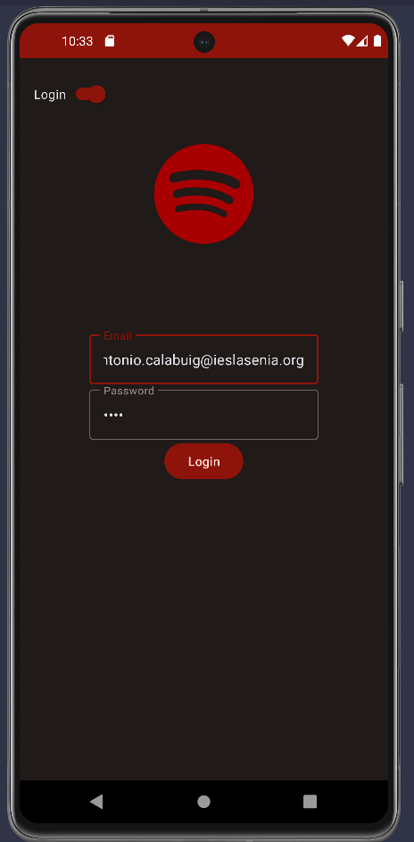

 

  

<h1 align="center">Spafy</h1>

  

    Spafy es una aplicación de música que te permite escuchar tus canciones favoritas, crear listas de reproducción y mucho más.
     
    <a href="https://github.com/Zenin0/Spafy/tree/main/app"><strong>Explora el Código »</strong></a>
     
     
    <a href="https://github.com/Zenin0/Spafy/issues">Reportar un Bug</a>
    ·
    <a href="https://github.com/Zenin0/Spafy/issues">Pedir una función</a>
  

<!-- Tabla de Contenidos -->

  
Tabla de Contenidos

  <ol>
    <li>
      <a href="#acerca-del-proyecto">Acerca del Proyecto</a>
      <ul>
        <li><a href="#construido-con">Construido con</a></li>
      </ul>
    </li>
    <li><a href="#uso">Uso</a></li>
    <li><a href="#roadmap">Roadmap</a></li>
    <li><a href="#licencia">Licencia</a></li>
    <li><a href="#contacto">Contacto</a></li>
  </ol>

<!-- Acerca del Proyecto -->

## Acerca del Proyecto

Spafy es una aplicación de música que te permite escuchar tus canciones favoritas, crear listas de
reproducción y mucho más.

### Construido con

Este código estará creado con `Kotlin` y `XML` para el desarrollo principal de la aplicación, `PHP`
para la gestión de la base
de datos, y `Symfony` para la creación de la API.

* 
* 
* 
* 

<!-- Ejemplos de uso -->

## Uso

### Ventana de Registro

  

### Ventana de Login

  

### Ventana de Home

  

### Ventana de Search

  

### Ventana de Library

  

### Ventana de Songs

  

### Ventana de Add to Playlist

  

### Ventana de Create Playlist

  

### Ventana de Profile Drawer

  

<!-- ROADMAP -->

## Roadmap

- [X] Crear el proyecto
- [X] Crear la base de datos
- [X] Crear la API
- [X] Login
- [X] Register
- [X] Home
- [X] Search
- [X] Library
- [X] Songs
- [X] Add to Playlist
- [X] Create Playlist
- [X] Profile Drawer

Mira los  [problemas abiertos](https://github.com/Zenin0/spafy/issues) para una lista completa de
las
propuestas (y errores conocidos).

<!-- LICENCIA --> 

## Licencia

Distribuida por la licencia CC0 (Creative Commons Zero). Mira `LICENSE` para mas información.

<!-- CONTACTO -->

## Contacto

Isaac - isaacsanz@proton.me

Project Link: [https://github.com/Zenin0/Spafy](https://github.com/Zenin0/Spafy)
